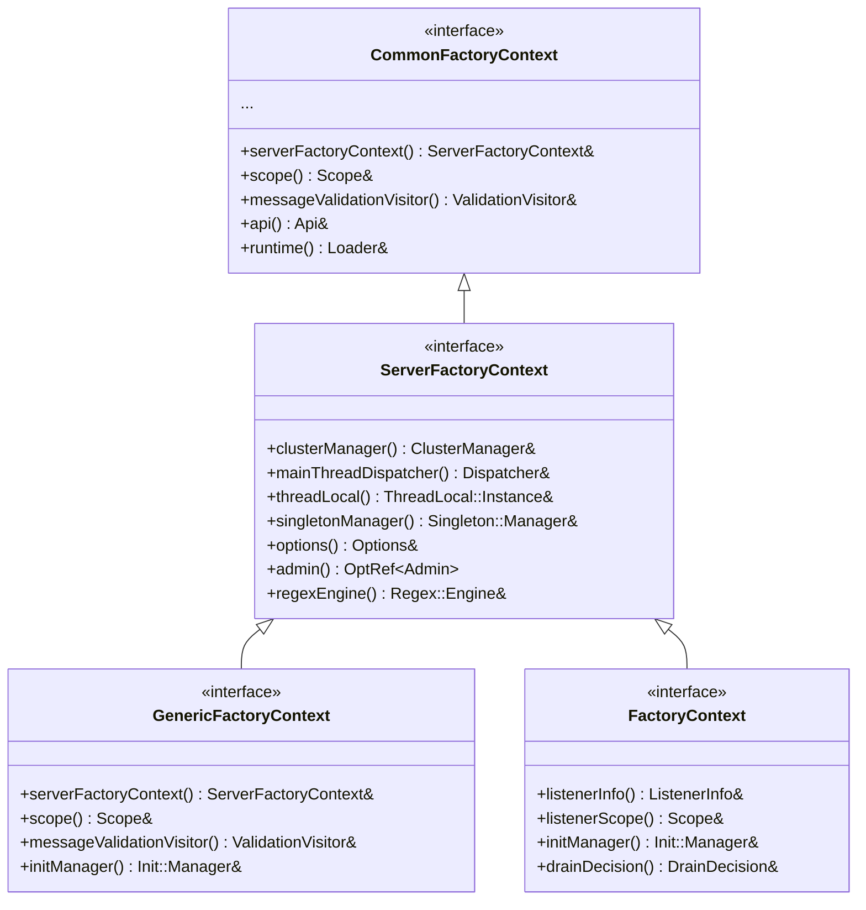
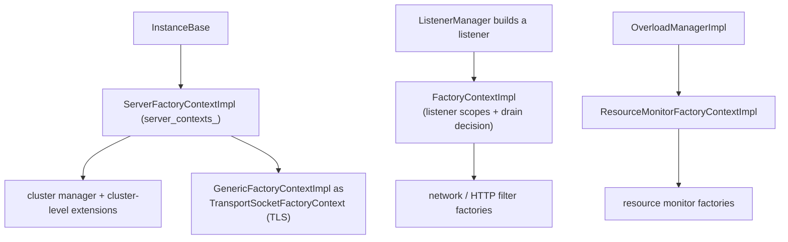

# Factory Context Layer — Overview

This document explains the context hierarchy, what each implementation forwards or holds, and
where each is constructed.

## 1. The interface hierarchy

The interfaces (in `envoy/server/factory_context.h` and related headers) form an inheritance
chain so that a more-specific context *is-a* less-specific one — a listener context can be passed
anywhere a server context is expected (via the appropriate accessor):



## 2. `ServerFactoryContextImpl` (the root adapter)

Defined in `server.h` (not `factory_context_impl.h`), `ServerFactoryContextImpl` is a thin
adapter that forwards each server-scoped accessor to the underlying `Server::Instance`:

```cpp
Upstream::ClusterManager& clusterManager() override { return server_.clusterManager(); }
Event::Dispatcher& mainThreadDispatcher() override { return server_.dispatcher(); }
ThreadLocal::Instance& threadLocal() override { return server_.threadLocal(); }
Singleton::Manager& singletonManager() override { return server_.singletonManager(); }
const Options& options() override { return server_.options(); }
Regex::Engine& regexEngine() override { return server_.regexEngine(); }
// ...and so on
```

It also implements `TransportSocketFactoryContext`, so the server's single
`server_contexts_` object doubles as the context for building transport sockets. This is the
seam that decouples the entire extension ecosystem from the concrete `InstanceBase`.

## 3. `GenericFactoryContextImpl` (the composable wrapper)

`generic_factory_context.{h,cc}` provides a small, reusable context that bundles:

- a `ServerFactoryContext&` (the server-wide services),
- a `Stats::Scope&` (where this thing's stats live),
- a `ProtobufMessage::ValidationVisitor&`, and
- an optional `Init::Manager*` (settable later via `setInitManager`).

```cpp
GenericFactoryContextImpl(ServerFactoryContext& server_context, Stats::Scope& stats_scope,
                          ValidationVisitor& validation_visitor, Init::Manager* init_manager = nullptr);
ServerFactoryContext& serverFactoryContext() override;  // forwards
Stats::Scope& scope() override;                          // the provided scope
Init::Manager& initManager() override;                   // the provided init manager
```

It has convenience constructors that derive from an existing `ServerFactoryContext` or another
`GenericFactoryContext`, so callers can re-scope without re-plumbing every service. This is the
go-to context wherever a factory needs a scope + init manager but no listener.

## 4. `TransportSocketFactoryContextImpl` (an alias)

`transport_socket_config_impl.h` is tiny:

```cpp
using TransportSocketFactoryContextImpl = GenericFactoryContextImpl;
```

So transport-socket factories (TLS, etc.) use a `GenericFactoryContextImpl`. The TLS-specific
services they need (secret manager, SSL context manager, stats) are reached through the wrapped
`ServerFactoryContext`, which itself implements `TransportSocketFactoryContext`.

## 5. `FactoryContextImpl` (listener-scoped)

`factory_context_impl.{h,cc}` is the **listener-level** context — this is what network and HTTP
filter factories receive. `FactoryContextImplBase` holds:

- the `Server::Instance&`,
- a validation visitor,
- two stats scopes: `scope_` (without the listener prefix) and `listener_scope_` (with it), and
- the `ListenerInfo`.

`FactoryContextImpl` extends it with a `Network::DrainDecision&` and an `Init::Manager&`:

```cpp
Init::Manager& initManager() override;
Network::DrainDecision& drainDecision() override;  // so filters can react to draining
```

The dual scopes matter: some filter stats belong under the listener's namespace and some don't,
and the drain decision lets a filter chain wind down gracefully (see
[`../drain/`](../drain/README.md)).

## 6. `ResourceMonitorFactoryContextImpl` (minimal)

`resource_monitor_config_impl.h` is header-only and exposes exactly the five services an
overload resource monitor needs:

```cpp
Event::Dispatcher& mainThreadDispatcher() override { return dispatcher_; }
const Server::Options& options() override { return options_; }
Api::Api& api() override { return api_; }
ProtobufMessage::ValidationVisitor& messageValidationVisitor() override { return validation_visitor_; }
Runtime::Loader& runtime() override { return runtime_; }
```

It is constructed by the overload manager when building monitors from config (see
[`../overload/`](../overload/README.md)).

## 7. Where contexts get constructed



The key idea throughout: a factory only ever sees the narrow context it needs, and every context
ultimately routes back to the one `ServerFactoryContextImpl` that fronts the real server.
