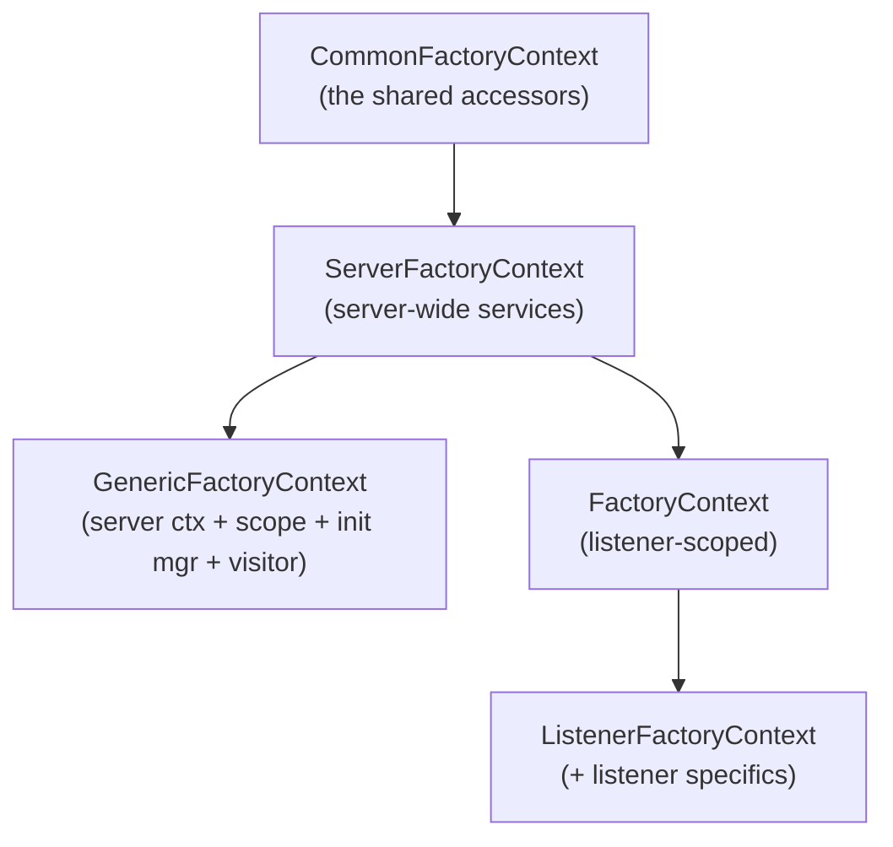

# Factory Context Layer

> Documentation for the extension-facing factory-context implementations.
> Source lives in `source/server/factory_context_impl.{h,cc}` (listener-level),
> `source/server/generic_factory_context.{h,cc}`,
> `source/server/transport_socket_config_impl.h`, and
> `source/server/resource_monitor_config_impl.h`. The server-scoped
> `ServerFactoryContextImpl` lives in `source/server/server.h`. Interfaces are in
> `envoy/server/factory_context.h` and friends.

Envoy is built almost entirely out of **extensions**: filters, transport sockets, clusters,
access loggers, resource monitors, and more. Each is created by a **factory**. A factory needs
access to server services (stats scope, dispatcher, runtime, cluster manager, ...) — but handing
it the raw `Server::Instance` would couple every extension to the concrete server. Instead,
factories receive a **factory context**: a curated bundle of exactly the services appropriate to
what they're building.

## Why several contexts?

Different factories need different (and differently-scoped) services. So there's a small family
of context interfaces, from broad to specific:

| Context | Used when building... | Scope |
|---------|----------------------|-------|
| `ServerFactoryContext` | things that live as long as the server (cluster-level, server singletons) | server-wide |
| `GenericFactoryContext` | things needing a stats scope + init manager but not a full listener | composable |
| `FactoryContext` / `ListenerFactoryContext` | network/HTTP filters in a listener | listener-scoped |
| `TransportSocketFactoryContext` | transport sockets (TLS) | (alias of generic) |
| `ResourceMonitorFactoryContext` | overload resource monitors | minimal |

## The implementations in this folder

| Class | File | Role |
|-------|------|------|
| `ServerFactoryContextImpl` | `server.h` (impl in `server.cc`) | Forwards every server-scoped accessor to `Server::Instance`. Also serves as the transport-socket factory context. |
| `GenericFactoryContextImpl` | `generic_factory_context.{h,cc}` | Reusable wrapper: server context + stats scope + validation visitor + optional init manager. |
| `FactoryContextImplBase` / `FactoryContextImpl` | `factory_context_impl.{h,cc}` | Listener-scoped context wrapping a `Server::Instance` + listener scopes + drain decision. |
| `TransportSocketFactoryContextImpl` | `transport_socket_config_impl.h` | A **type alias** of `GenericFactoryContextImpl`. |
| `ResourceMonitorFactoryContextImpl` | `resource_monitor_config_impl.h` | Header-only 5-service context for overload monitors. |

## Documentation map

| Document | Contents |
|----------|----------|
| `OVERVIEW.md` | The context hierarchy, what each implementation forwards/holds, and how/where they're constructed. |
| `CLASS_HIERARCHY.md` | UML diagrams for the interfaces and their implementations. |

## One-paragraph mental model

When the server needs to build an extension, it constructs the appropriate factory context and
passes it to the factory's `create...()` method. `ServerFactoryContextImpl` is the root — a thin
adapter that forwards each accessor to the `Server::Instance`. Lighter contexts compose on top:
`GenericFactoryContextImpl` bundles a `ServerFactoryContext` with a stats scope, a validation
visitor, and an optional init manager (and is reused verbatim as the transport-socket context);
`FactoryContextImpl` adds listener scopes and a drain decision for listener-level filters; and
`ResourceMonitorFactoryContextImpl` exposes just the five services an overload monitor needs.
