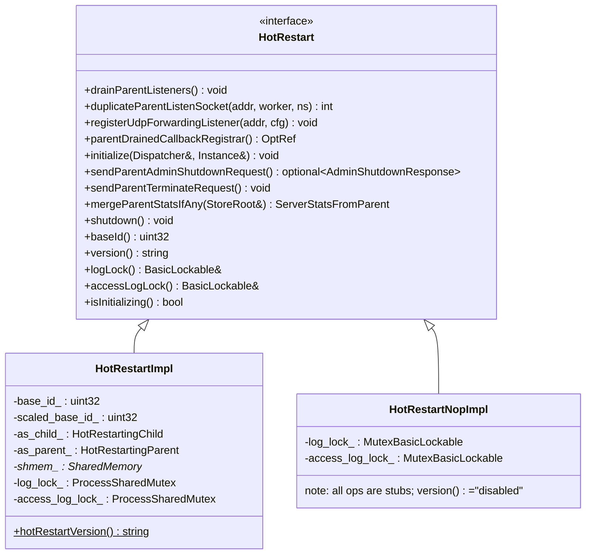
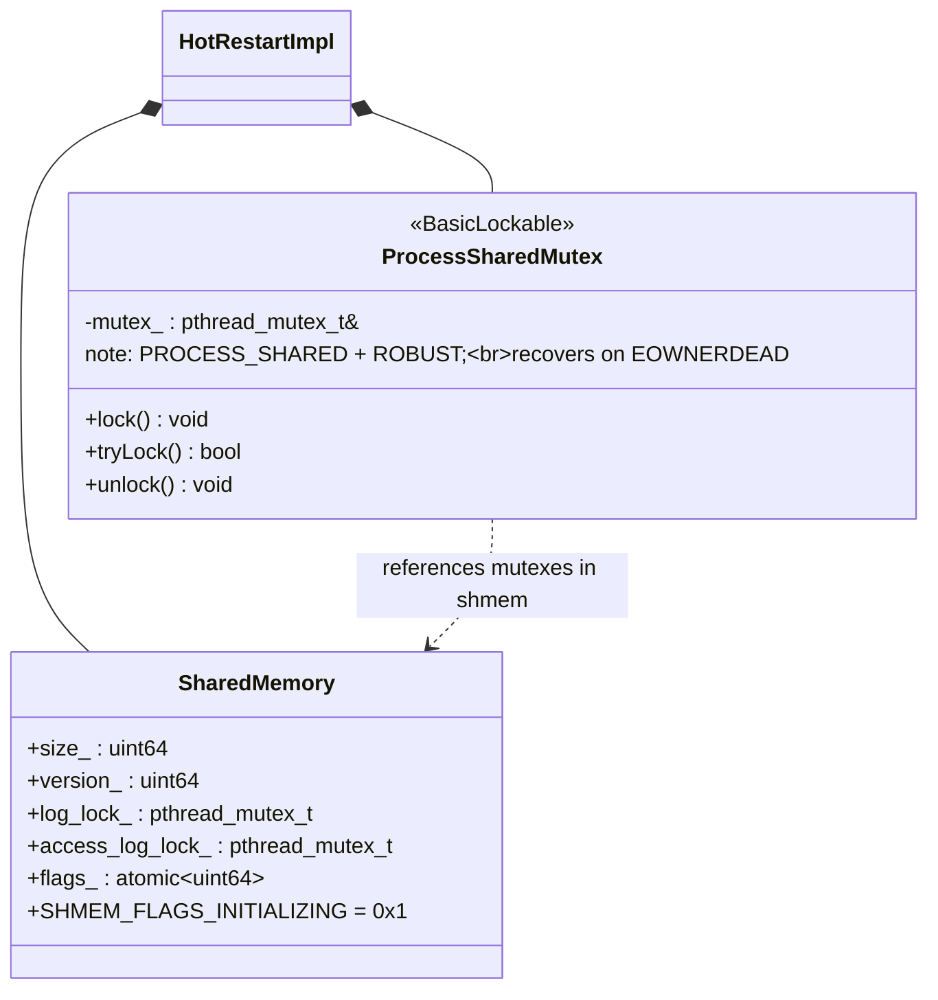
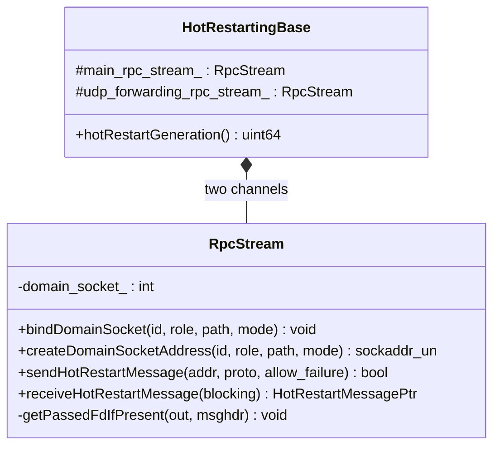
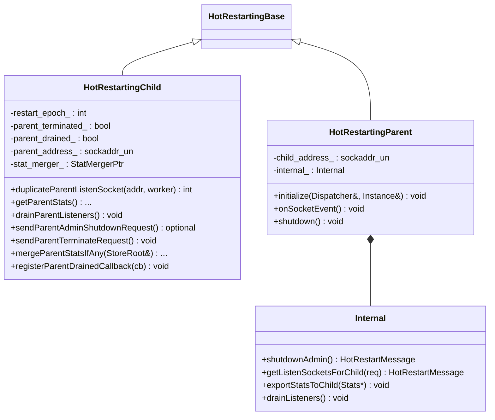
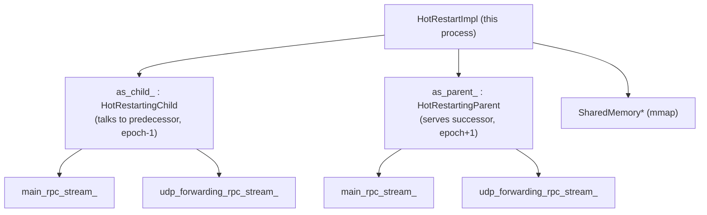

# Hot Restart — Class Hierarchy

UML-style class diagrams for the hot restart subsystem. Documentation aids, not exhaustive.

## 1. The interface and implementations

## 2. Shared memory and process-shared mutex

## 3. Transport classes

## 4. Child and parent roles

## 5. Ownership at runtime

Each process is both a child (of the older process it is replacing) and a parent (ready to
serve a future replacement), which is why both halves are always constructed.
