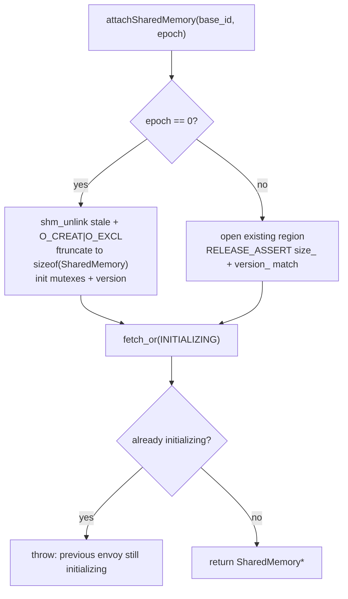
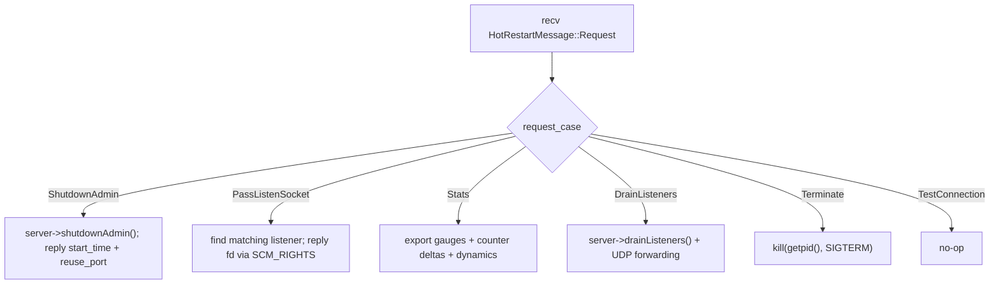

# Hot Restart — Overview

This document explains the moving parts: the shared-memory region, the domain-socket
transport, file-descriptor passing, the child and parent roles, versioning, and dynamic
base id.

## 1. `HotRestartImpl` — the coordinator

`HotRestartImpl` (`hot_restart_impl.{h,cc}`) is the real implementation behind the
`HotRestart` interface. It:

- attaches (or creates) the shared-memory region,
- owns an `as_child_` (`HotRestartingChild`) and an `as_parent_` (`HotRestartingParent`),
- exposes process-shared log locks living in shared memory,
- computes the version string.

It scales the base id by 10 (`scaled_base_id_ = base_id * 10`) to leave headroom so socket
names from adjacent base ids cannot collide. On construction it also calls
`prctl(PR_SET_PDEATHSIG, SIGTERM)` so a child self-terminates if its launching parent dies,
preventing orphaned processes.

## 2. The shared-memory region

```cpp
struct SharedMemory {
  uint64_t size_;
  uint64_t version_;
  pthread_mutex_t log_lock_;
  pthread_mutex_t access_log_lock_;
  std::atomic<uint64_t> flags_;   // only bit: SHMEM_FLAGS_INITIALIZING
};
```

What lives here — and what does **not**:

- **Robust, process-shared pthread mutexes** for log + access-log file serialization, so
  multiple coexisting Envoys don't interleave writes. "Robust" means if the lock holder
  crashes, a survivor recovers via `pthread_mutex_consistent()` on `EOWNERDEAD` instead of
  deadlocking.
- **A `size_`/`version_` self-description** used as a compatibility guard.
- **A single `SHMEM_FLAGS_INITIALIZING` bit** that prevents two processes initializing at
  once.
- **Stats are NOT stored here.** In this version, stats are transferred over the socket via
  the `Stats` RPC and merged with a `StatMerger`. The shared region is just locks + version
  + the init flag.

Attach/create logic (`attachSharedMemory`):



The `INITIALIZING` bit is cleared once the child has fully taken over, inside
`drainParentListeners()`:

```cpp
void HotRestartImpl::drainParentListeners() {
  as_child_.drainParentListeners();
  shmem_->flags_ &= ~SHMEM_FLAGS_INITIALIZING;  // a new Envoy may now start
}
```

## 3. The domain-socket transport

`HotRestartingBase` owns **two** independent `RpcStream`s, each an `AF_UNIX`, `SOCK_DGRAM`
socket:

| Channel | Purpose |
|---------|---------|
| `main_rpc_stream_` | Request/reply control channel: sockets, stats, drain, terminate. |
| `udp_forwarding_rpc_stream_` | A separate channel for forwarding QUIC/UDP packets parent→child during draining. |

Two channels exist because the restarter is single-threaded: a forwarded UDP packet must
never be mistaken for a pending control-channel reply.

**Socket naming:** `"<socket_path>_<role>_<base_id + (epoch % 3)>"`. Default `socket_path`
is the abstract-namespace `@envoy_domain_socket`; default mode is `0`. Both are overridable
via `--socket-path` / `--socket-mode`. A bind collision raises
`HotRestartDomainSocketInUseException` (used by dynamic-base-id retry).

**Framing:** each message is an 8-byte big-endian length prefix followed by a serialized
`envoy.HotRestartMessage`, sent in ≤4096-byte datagrams; long protos span continuation
datagrams. `ECONNREFUSED` (parent not ready yet) is retried up to 10 times with a 1s delay.

## 4. Passing listen sockets via `SCM_RIGHTS`

This is the heart of the magic. When the parent replies to a `PassListenSocket` request
with a real fd, the fd is attached as ancillary control data on the `sendmsg`:

```cpp
if (replyIsExpectedType(&proto, Reply::kPassListenSocket) &&
    proto.reply().pass_listen_socket().fd() != -1) {
  cmsghdr* cm = CMSG_FIRSTHDR(&message);
  cm->cmsg_level = SOL_SOCKET;
  cm->cmsg_type  = SCM_RIGHTS;             // <-- transfer a file descriptor
  cm->cmsg_len   = CMSG_LEN(sizeof(int));
  *reinterpret_cast<int*>(CMSG_DATA(cm)) = proto.reply().pass_listen_socket().fd();
}
```

On the receiving side, the kernel has duplicated the fd into the child; `getPassedFdIfPresent`
pulls it out of the control data and writes it back into the reply proto so callers just see
a working fd. Because an fd must fit in a single datagram, the code asserts the message was
not fragmented.

## 5. The two roles

### `HotRestartingChild` (the new process)

Binds its own socket (role "child", epoch N), computes the parent's address (role "parent",
epoch N−1), and issues blocking requests on the control channel:

| Method | Request | Effect |
|--------|---------|--------|
| `sendParentAdminShutdownRequest()` | `ShutdownAdmin` | Parent releases admin port; returns original start time + reuse_port default. |
| `duplicateParentListenSocket(addr, worker)` | `PassListenSocket` | Returns the parent's fd for that address/worker, or `-1`. |
| `getParentStats()` | `Stats` | Returns the parent's stats for merging. |
| `drainParentListeners()` | `DrainListeners` | Fire-and-forget; parent begins draining. |
| `sendParentTerminateRequest()` | `Terminate` | Parent kills itself; tears down the stat merger. |
| `abortDueToFailedParentConnection()` | `TestConnection` (allow_failure) | Probe; supports `--skip-hot-restart-on-no-parent` fallback. |

Every sender short-circuits when `parent_terminated_` is true (which is the case from the
start for epoch 0), so the same code path works for the very first process. Stats are merged
with `Stats::StatMerger`, applying counter *deltas*, gauge values, and dynamic name spans.

### `HotRestartingParent` (the old process)

Registers an edge-triggered read event on its control socket and dispatches each request
through a nested `Internal` helper:



`getListenSocketsForChild` scans `listenerManager().listeners()` for one whose
`localAddress()` and socket type match the requested address (optionally inside a network
namespace), and replies with that socket's fd. `exportStatsToChild` sends current gauge
values and latched counter deltas, plus `memory_allocated` and `num_connections`, so the
child's metrics continue seamlessly.

## 6. Versioning and compatibility

- `HOT_RESTART_VERSION = 11`, bumped on any shared-memory/RPC change.
- `version()` = `"{HOT_RESTART_VERSION}.{sizeof(SharedMemory)}"`. Mixing the struct size in
  means any layout change forces an incompatible version automatically.
- Launch scripts call `envoy --hot-restart-version` and compare the old/new binaries before
  attempting a hot restart. The string is also on `/hot_restart_version` and in
  `/server_info`.
- On attach, mismatched `size_`/`version_` triggers a `RELEASE_ASSERT` — i.e. you **cannot**
  hot restart into an incompatible binary; ops must do a full restart instead.

## 7. Dynamic base id

`--use-dynamic-base-id` (mutually exclusive with a non-zero `--restart-epoch`) makes the
server try up to 100 random base ids, constructing `HotRestartImpl` until the domain socket
binds successfully (catching `HotRestartDomainSocketInUseException`). The chosen base id can
be written to `--base-id-path` so the launcher knows which id the next epoch should use.

## 8. `HotRestartNopImpl`

A header-only no-op used when `--disable-hot-restart` is set or in config-validation mode.
Every method is a trivial stub: `duplicateParentListenSocket` returns `-1`,
`mergeParentStatsIfAny` returns zeros, `baseId()` returns `0`, and `version()` returns
`"disabled"`. It still provides real *local* (non-shared) log locks. Selection happens in
`source/exe/stripped_main_base.cc`.
