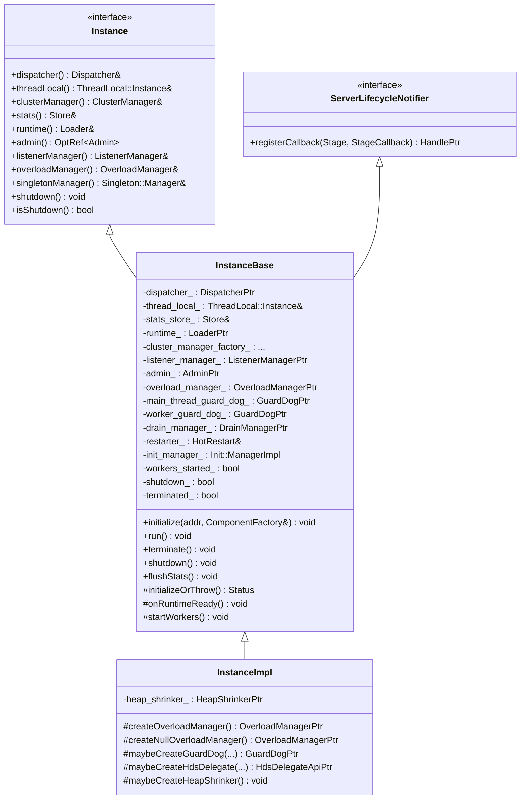
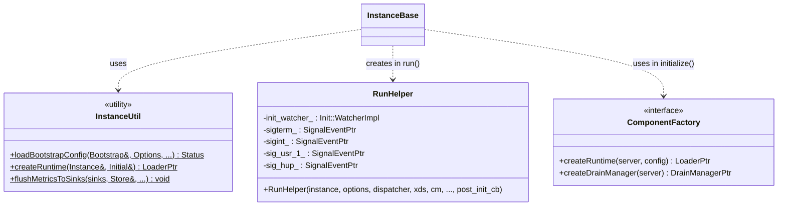
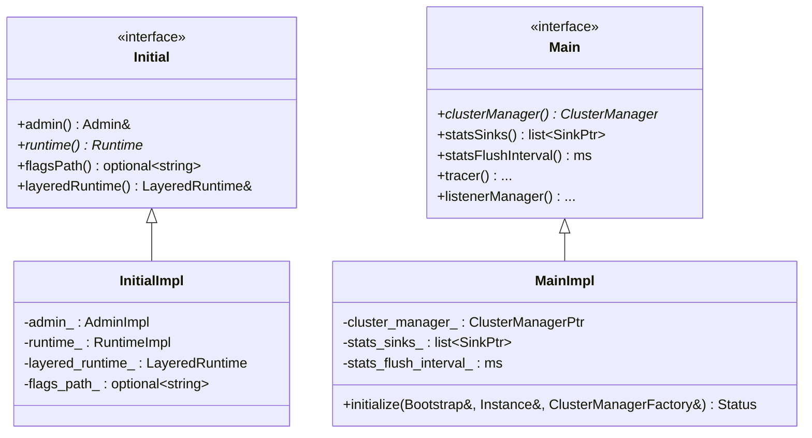
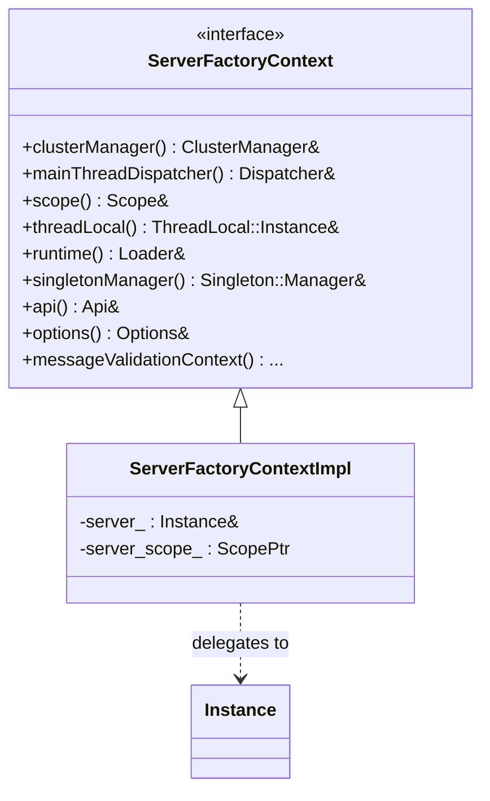

# Server Lifecycle — Class Hierarchy

UML-style class diagrams for the server instance, configuration, and factory context.
These are documentation aids, not exhaustive header transcriptions.

## 1. The instance

`InstanceBase` is abstract: it defines the entire lifecycle but defers a handful of
"how do I build the production version of X" decisions to virtual methods. `InstanceImpl`
provides the production answers. Test/validation servers provide different ones (see
`../config_validation` and the test fixtures).

## 2. Bootstrap helpers and run helper

`RunHelper` exists primarily so the early-shutdown-during-startup behavior can be unit
tested in isolation. Its constructor performs all the "about to run the loop" wiring.

## 3. Configuration objects

`InitialImpl` is parsed first (its fields are needed before the main config). `MainImpl`
holds the rest, and its `initialize()` is what actually builds the cluster manager and the
stats sinks from the bootstrap proto.

## 4. The factory context

`ServerFactoryContextImpl` is a thin adapter: it forwards each accessor to the underlying
`Instance` (or a scoped view of it). Extensions receive this context instead of the raw
server so the extension API stays decoupled from the concrete server implementation.
