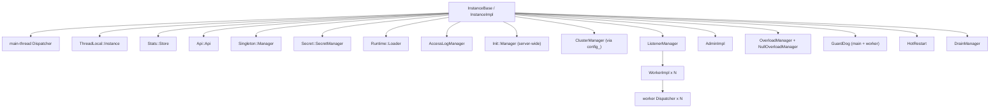
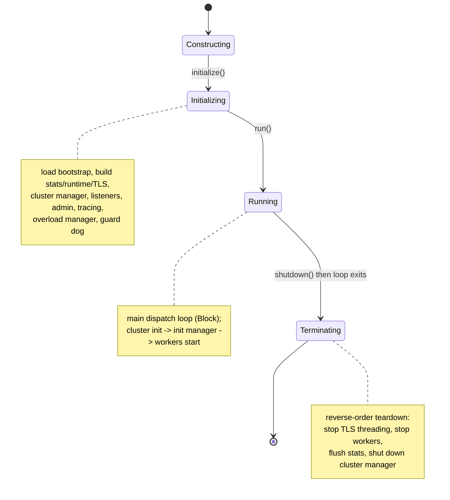
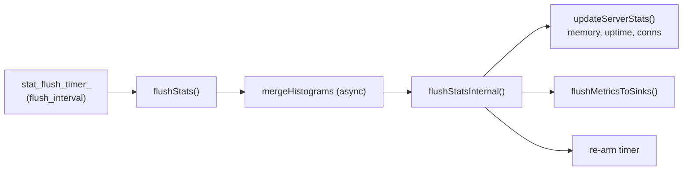

# Server Lifecycle — Overview

This document explains the architecture of the server instance: who owns what, the three
lifecycle phases, and the design rules that hold it all together.

## 1. The ownership model

`InstanceBase` is the root of almost every long-lived object in the process. Think of it
as a composition root. Its member fields (declared in `server.h`) are constructed in a
carefully chosen order and destroyed in the reverse order. A simplified ownership tree:



The order matters: stats and the thread-local system come up before anything that needs
to register stats or thread-local slots; the cluster manager comes up before listeners
(listeners route to clusters); the admin console is created early so it can report status
even while the rest of the server is still initializing.

## 2. The `Instance` interface

The rest of Envoy never talks to `InstanceBase` directly — it talks to the
`Server::Instance` interface (`envoy/server/instance.h`). This is the "service locator"
for the process. A few of the most-used accessors:

| Accessor | Returns |
|----------|---------|
| `dispatcher()` | the main-thread event loop |
| `threadLocal()` | the thread-local slot allocator |
| `clusterManager()` | upstream cluster management |
| `stats()` | the stats store |
| `runtime()` | runtime (feature flag) snapshots |
| `admin()` | the admin console (may be absent) |
| `sslContextManager()` | TLS context management |
| `listenerManager()` | listener management |
| `overloadManager()` | overload/load-shed state |
| `singletonManager()` | process-wide singletons |
| `lifecycleNotifier()` | register for lifecycle stage callbacks |

`InstanceBase` also implements `ServerLifecycleNotifier`, so other components can register
callbacks for the `Startup`, `PostInit`, and `ShutdownExit` stages.

## 3. The three phases



### Phase 1 — `initialize()`

`initialize()` (server.cc) is a thin wrapper that sets up file logging, initializes the
hot restarter, creates the drain manager, then calls `initializeOrThrow()` inside a
try/catch that logs and `terminate()`s on failure. `initializeOrThrow()` is the long
function that actually builds the world. See `startup_sequence.md` for the blow-by-blow.

### Phase 2 — `run()`

`run()` constructs a `RunHelper` (which installs signal handlers and registers the
cluster-manager init callback), creates a main-thread watchdog, posts the `Startup`
lifecycle notification, then calls:

```cpp
dispatcher_->run(Event::Dispatcher::RunType::Block);
```

This blocks the main thread inside the event loop until `shutdown()` causes the loop to
exit. When it returns, `run()` stops the main watchdog and calls `terminate()`.

### Phase 3 — `terminate()`

`terminate()` is idempotent (guarded by `terminated_`) and tears down in reverse
dependency order:

1. `thread_local_.shutdownGlobalThreading()` — stop cross-thread slot updates.
2. `stats_store_.shutdownThreading()` — stop threaded stat merging.
3. Shut down all config muxes (xDS).
4. `overload_manager_->stop()`.
5. `listener_manager_->stopWorkers()` — stop all worker threads.
6. `flushStatsImpl()` — a final stats flush (unless hot restarted).
7. `clusterManager()->shutdown()`.

## 4. Bootstrap configuration

The bootstrap proto (`envoy.config.bootstrap.v3.Bootstrap`) is loaded by
`InstanceUtil::loadBootstrapConfig()` from one of `--config-path`, `--config-yaml`, or an
inline proto, and validated. It is then split into two configuration views in
`configuration_impl.{h,cc}`:

- **`InitialImpl`** — the parts needed *first*: admin config, runtime layers, the flags
  path, the `LayeredRuntime`, and the stats flush settings.
- **`MainImpl`** — the rest: stats sinks, tracing, the watchdog configs, and the wiring to
  the cluster manager.

Stats-flushing configuration (`flush_interval`, on-admin-request flushing) lives here and
is consumed by `InstanceBase::flushStats()`, which runs on a periodic `stat_flush_timer_`.

## 5. The factory context

Extensions (filters, transport sockets, resource monitors, ...) are built by factories
that need access to server services. Rather than handing them the whole `Instance`, the
server hands them a **`ServerFactoryContextImpl`** (`factory_context_impl.{h,cc}`), which
exposes exactly the safe, server-scoped accessors a factory should use. This keeps the
extension API decoupled from the concrete server object.

## 6. Stats lifecycle

`InstanceBase` keeps server-wide stats (the `ALL_SERVER_STATS` macro in `server.h`):
uptime, memory, connection counts, `live`, `state`, hot-restart epoch, and so on. They are
refreshed periodically:



## 7. Design rules to remember

- **The main thread owns the main dispatcher.** Everything in `initialize()`/`run()`/
  `terminate()` runs on the main thread.
- **`initialize()` can throw; `run()`/`terminate()` should not.** Initialization failures
  call `terminate()` then rethrow so the process exits non-zero with a clear log.
- **Workers do not start until clusters are initialized.** This avoids routing traffic to
  clusters that have no endpoints yet (see the init-manager handshake in
  `startup_sequence.md`).
- **`terminate()` is reverse-order and idempotent.** It can be reached from a failed
  `initialize()` or from a normal shutdown.
