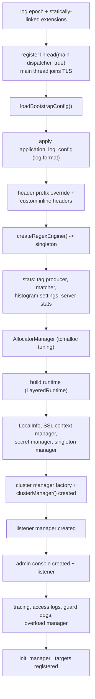
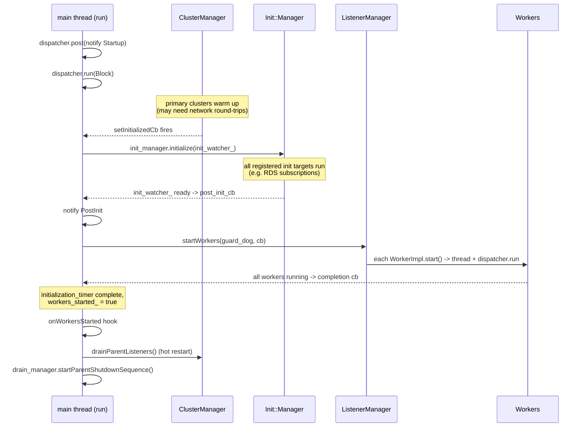

# Server Startup Sequence

This is the detailed, ordered walk-through of how a process goes from `main()` to
serving traffic. File references point at `source/server/server.cc` unless noted.

## 1. From `main()` to the instance

The entry point lives in `source/exe/` (documented separately). In short:

```
main()  →  MainCommon::main()  →  MainCommonBase  →  StrippedMainBase
        →  constructs the HotRestart, the InstanceImpl, then calls run()
```

`StrippedMainBase` picks the hot-restart implementation (real vs no-op), constructs the
`InstanceImpl`, and ultimately calls `server_->run()`.

## 2. `initialize()` → `initializeOrThrow()`

`initialize()` (server.cc:369) sets up the file logger, initializes the hot restarter
(`restarter_.initialize(...)`), creates the drain manager, and calls
`initializeOrThrow()` inside a try/catch that `terminate()`s and rethrows on any failure.

`initializeOrThrow()` (server.cc:399) is the real bootstrap. The major steps, in order:



Key things that happen here:

- **The main thread registers with TLS first** (server.cc:411) so any code that uses
  thread-local storage during initialization has a valid main-thread slot.
- **Stats infrastructure comes up before most subsystems** because the stats matcher /
  histogram settings may reference regexes, and almost everything registers stats.
- **The regex engine is injected as a singleton** before stats, because the stats matcher
  config can contain regexes.
- **The cluster manager is created mid-way** and registered with the server's init manager
  so its initialization is tracked.
- **The admin console is created early** (when `ENVOY_ADMIN_FUNCTIONALITY` is compiled in)
  so `/ready` and `/server_info` can report progress.

## 3. `run()` and the init handshake

`run()` (server.cc:918) constructs a `RunHelper`, which does three things in its
constructor (server.cc:850):

1. **Installs signal handlers** (if enabled): `SIGTERM`/`SIGINT` → `instance.shutdown()`;
   `SIGUSR1` → reopen access logs; `SIGHUP` → logged and ignored (hot restart is *not*
   triggered by SIGHUP — it's launcher-driven).
2. **Starts the overload managers** (`overload_manager.start()` and the null one).
3. **Registers a cluster-manager "initialized" callback.** This is the crux of the
   ordering guarantee:

```cpp
cm.setInitializedCb([&instance, &init_manager, &xds_manager, this]() {
  if (instance.isShutdown()) return;
  Config::ScopedResume resume_rds = xds_manager.pause(RouteConfiguration);
  init_manager.initialize(init_watcher_);   // run all server-wide init targets
});
```

The full startup handshake:



Why this order? Envoy must not accept downstream traffic before its upstream clusters
have endpoints, or requests would fail. So:

1. **Cluster manager initializes first** (primary clusters).
2. **Then the init manager runs** (this subscribes to dynamic resources like RDS; RDS is
   paused during the callbacks and resumed when they complete, so all static RDS
   subscriptions are registered atomically).
3. **Only then do workers start** and listeners begin accepting connections.

## 4. `onRuntimeReady()` — secondary clusters and HDS

After RTDS (runtime discovery) has applied, `onRuntimeReady()` (server.cc:771):

- initializes **secondary clusters** (`clusterManager().initializeSecondaryClusters()`),
- sets up the **HDS delegate** if `hds_config` is present (health-discovery service),
- warns about deprecated global-connection-limit runtime keys.

## 5. `startWorkers()`

`startWorkers()` (server.cc:810) tells the listener manager to start all workers, passing
a completion callback that runs once every worker's event loop is live:

```cpp
listener_manager_->startWorkers(worker_guard_dog_, [this]() {
  if (isShutdown()) return;
  initialization_timer_->complete();   // record startup time histogram
  updateServerStats();
  workers_started_ = true;
  hooks_.onWorkersStarted();
  restarter_.drainParentListeners();              // tell hot-restart parent to drain
  drain_manager_->startParentShutdownSequence();  // arm parent-terminate timer
});
```

At this moment Envoy is fully up: all listening ports are bound and accepting.

## 6. Shutdown

`shutdown()` flips `shutdown_ = true` and exits the main dispatcher. The main thread
returns from `dispatcher_->run(Block)` and `run()` calls `terminate()` (see the teardown
sequence in `OVERVIEW.md` §3). `/quitquitquit` on the admin console calls the same
`shutdown()` path, as does `SIGTERM`/`SIGINT`.

## 7. The hot-restart connection

If this process is a hot-restart child, several of the above steps also coordinate with
the *parent* process (asking for its listen sockets, merging its stats, then telling it to
drain and terminate). That choreography is documented in
[`../hot_restart/`](../hot_restart/README.md).
