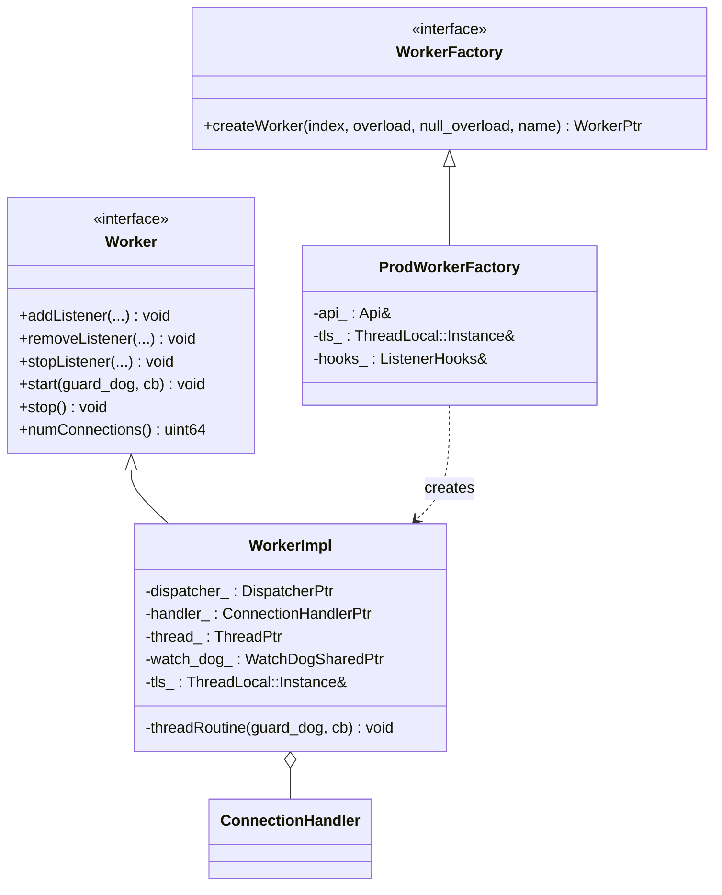
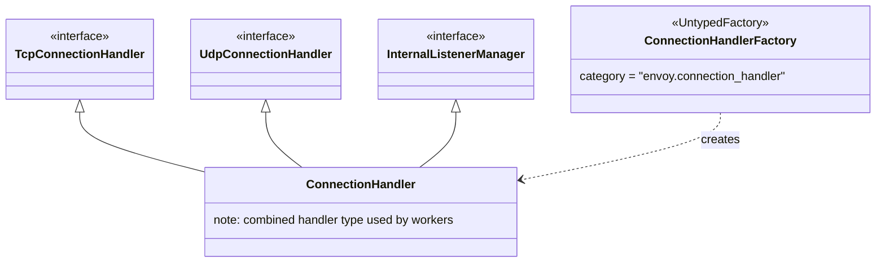
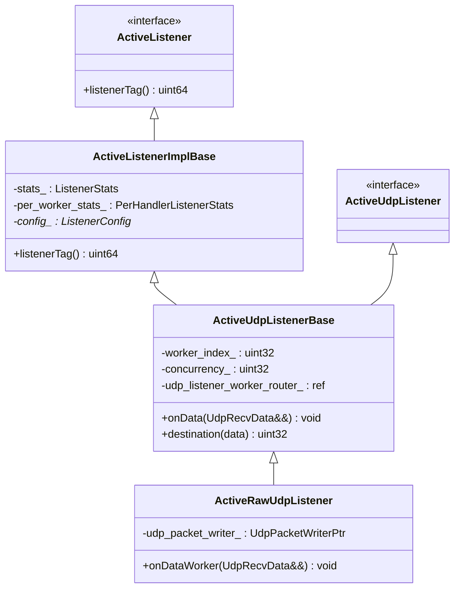
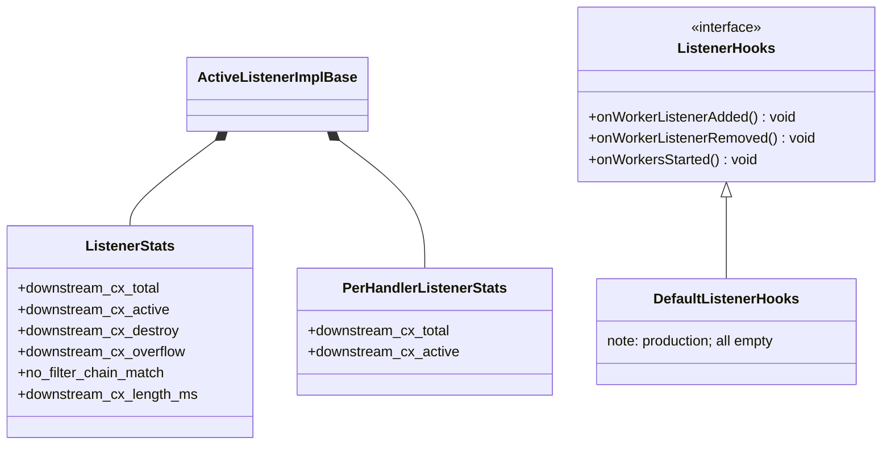
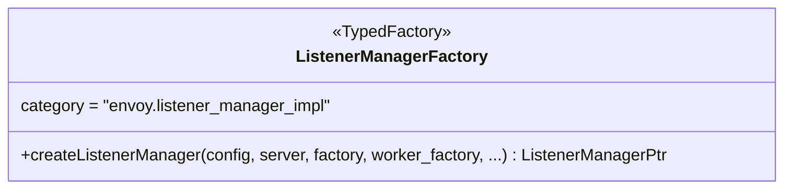
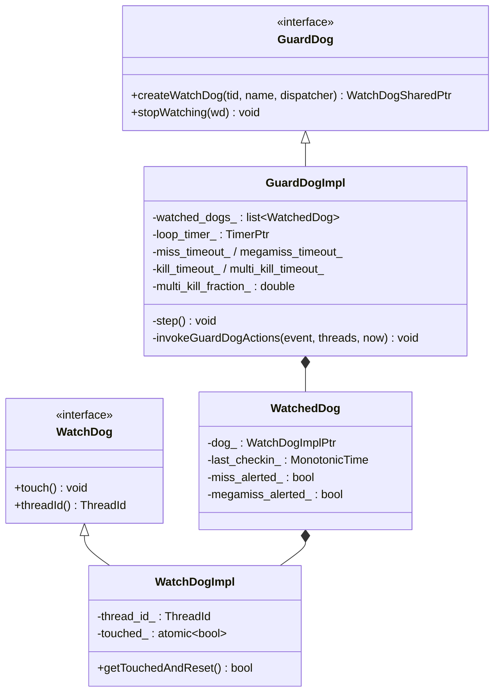

# Workers & Listeners — Class Hierarchy

UML-style class diagrams for the worker, listener-acceptance, and guard/watch dog code.
Documentation aids, not exhaustive.

## 1. Worker and factory

## 2. Connection handler

## 3. Active listeners

(The TCP active listener, `ActiveTcpListener`, lives in
`source/common/listener_manager/` and also derives from `ActiveListenerImplBase` via a
stream-listener base.)

## 4. Stats and hooks

## 5. Listener manager factory

## 6. Guard dog and watch dog

The dispatcher's `WatchdogRegistration` (in `source/common/event/`) holds the `WatchDog` and
arms the touch timer; see `guarddog.md` for the touch + escalation mechanics.
