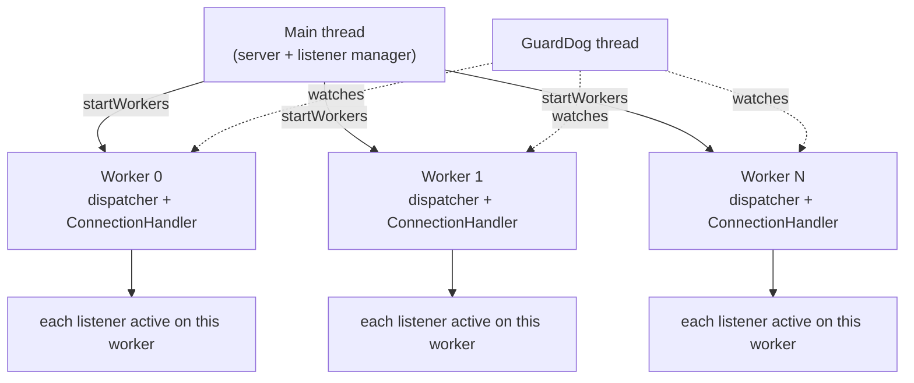

# Workers & Listener Acceptance

> Documentation for Envoy's worker-thread and listener-acceptance code.
> Source lives in `source/server/worker_impl.{h,cc}`, `source/server/active_listener_base.h`,
> `source/server/active_udp_listener.{h,cc}`, `source/server/listener_manager_factory.h`,
> `source/server/listener_stats.h`, `source/server/listener_hooks.h`, plus the guard/watch
> dog in `source/server/guarddog_impl.{h,cc}` and `source/server/watchdog_impl.h`.
> Interfaces: `envoy/server/worker.h`, `envoy/server/guarddog.h`, `envoy/server/watchdog.h`.

This is where Envoy's **data-plane concurrency** lives: the worker threads that own event
loops and accept connections, the per-listener state on each worker, and the guard dog that
makes sure none of those threads hang.

## The worker model in one picture

Envoy runs `--concurrency` worker threads. **Every listener is added to every worker**, so
each worker independently `listen()`s (via `SO_REUSEPORT` or a duplicated fd) and accepts
connections. The kernel and/or Envoy's connection balancer spread accepts across workers.

## The cast of characters

| Component | File | Role |
|-----------|------|------|
| `Worker` / `WorkerImpl` | `worker_impl.{h,cc}` | A thread + dispatcher + `ConnectionHandler`. The unit of data-plane concurrency. |
| `ProdWorkerFactory` | `worker_impl.{h,cc}` | Builds production workers (allocates dispatcher + handler). |
| `ConnectionHandler` | `listener_manager_factory.h` | Combined TCP + UDP + internal listener handling on a worker. |
| `ActiveListenerImplBase` | `active_listener_base.h` | Per-listener active state + stats on a worker. |
| `ActiveUdpListenerBase` / `ActiveRawUdpListener` | `active_udp_listener.{h,cc}` | UDP datagram routing + filter chain. |
| `ListenerHooks` / `DefaultListenerHooks` | `listener_hooks.h` | Test-integration seam for listener lifecycle events. |
| `ListenerStats` / `PerHandlerListenerStats` | `listener_stats.h` | Per-listener (and per-worker) stat structs. |
| `GuardDogImpl` | `guarddog_impl.{h,cc}` | Background thread that detects hung worker threads. |
| `WatchDogImpl` | `watchdog_impl.h` | An atomic "touched" flag per watched thread. |

## Documentation map

| Document | Contents |
|----------|----------|
| `OVERVIEW.md` | The worker thread lifecycle, how listeners are added, TCP accept + connection balancing, UDP routing, and the factory/stats/hooks seams. |
| `guarddog.md` | The guard dog / watch dog liveness system: touching, miss/megamiss/kill/multikill escalation. |
| `CLASS_HIERARCHY.md` | UML diagrams for the worker, connection handler, active listeners, and the guard/watch dog. |

## One-paragraph mental model

`ListenerManagerImpl::startWorkers()` adds every active listener to every `WorkerImpl`
(each call posted onto that worker's dispatcher), then calls `start()` on each worker, which
spawns an OS thread running `dispatcher_->run(Block)`. Inside the loop, a posted callback
registers a `WatchDog` with the guard dog. Each worker's `ConnectionHandler` accepts
connections; a TCP accept may be rebalanced to another worker via a `ConnectionBalancer`,
and UDP datagrams are routed to the owning worker via a `UdpListenerWorkerRouter`. The
already-running `GuardDog` thread periodically checks that every worker has "touched" its
watchdog recently, escalating from a stat increment all the way to killing the process if a
thread is stuck.
