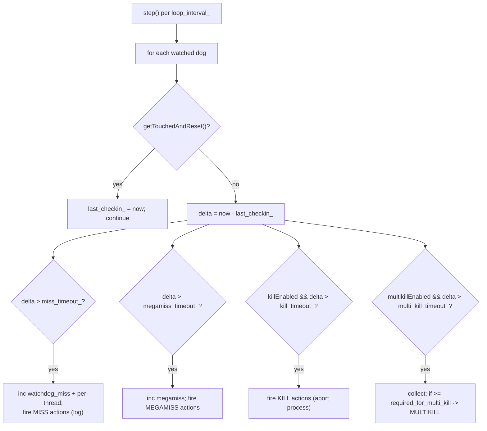

# Guard Dog & Watch Dog

Envoy's liveness watchdog system detects **hung event-loop threads** (main or worker) and
escalates from a metric all the way to crashing the process so a stuck Envoy is restarted
rather than silently black-holing traffic.

Source: `source/server/guarddog_impl.{h,cc}`, `source/server/watchdog_impl.h`. Interfaces:
`envoy/server/guarddog.h`, `envoy/server/watchdog.h`.

## 1. The two objects

| Object | What it is |
|--------|-----------|
| `WatchDogImpl` | A per-watched-thread object: an atomic "touched" flag + a thread id. Header-only. |
| `GuardDogImpl` | A single background thread that periodically scans all registered watchdogs. |

`WatchDogImpl` is deliberately tiny:

```cpp
class WatchDogImpl : public WatchDog {
public:
  bool getTouchedAndReset() { return touched_.exchange(false, std::memory_order_relaxed); }
  void touch() override {
    bool expected = false;
    touched_.compare_exchange_strong(expected, true, std::memory_order_relaxed);
  }
private:
  const Thread::ThreadId thread_id_;
  std::atomic<bool> touched_{false};
};
```

The watched thread sets the flag via `touch()`; the guard dog clears and reads it via
`getTouchedAndReset()`. A thread that is alive and pumping its event loop touches its dog
regularly; a hung thread does not.

## 2. How dispatchers touch their watchdog

When `GuardDogImpl::createWatchDog` registers a dog, it also calls
`dispatcher.registerWatchdog(dog, wd_interval)` where `wd_interval = loop_interval_ / 2`.
Inside the dispatcher (`source/common/event/dispatcher_impl.*`):

- a `WatchdogRegistration` arms a `touch_timer_` that fires every `min_touch_interval` and
  calls `watchdog_->touch()`, and
- defensively, `touchWatchdog()` is also called from the fd-event, timer,
  schedulable-callback, post, and deferred-delete paths — so even a thread draining a long
  callback list (where the timer might not get a turn) still registers as alive.

## 3. The monitoring loop and escalation

`GuardDogImpl` runs its own thread + dispatcher with a `loop_timer_` that fires every
`loop_interval_` (the minimum of the enabled timeouts). Each iteration, `step()` scans every
watched dog:



The four escalation levels:

| Level | Condition | Default effect |
|-------|-----------|----------------|
| **MISS** | `delta > miss_timeout_` | Increment `server.watchdog_miss` + per-thread counter; fire MISS actions (one-shot via `miss_alerted_`). |
| **MEGAMISS** | `delta > megamiss_timeout_` | Increment mega-miss counters; fire MEGAMISS actions. |
| **KILL** | `killEnabled() && delta > kill_timeout_` | Fire KILL actions — by default an `AbortAction` that crashes the process. |
| **MULTIKILL** | `multikillEnabled() && delta > multi_kill_timeout_` | Only fires once enough threads are simultaneously stuck. |

`required_for_multi_kill = max(2, ceil(multi_kill_fraction_ * num_watched_dogs))` — this
guards against killing the process just because one thread is briefly slow; MULTIKILL needs
a *fraction* of threads stuck at once.

When `kill_timeout > 0`, an abort action is auto-added so KILL actually aborts even if no
custom action is configured. `invokeGuardDogActions` dispatches to the `events_to_actions_`
map built from configured `WatchdogAction`s plus those defaults.

## 4. Registration and thread lifecycle

- `createWatchDog(thread_id, name, dispatcher)` builds a `WatchDogImpl`, wraps it in a
  `WatchedDog` tracking struct (`last_checkin_`, alert flags, per-thread counters), pushes it
  onto `watched_dogs_` under a lock, and registers it with the dispatcher.
- `stopWatching(dog)` removes it from `watched_dogs_`.
- `start()` spawns the `dog:<name>` thread running `dispatcher_->run(RunUntilExit)` and uses
  an `absl::Notification` so the constructor blocks until the guard-dog thread is live.
- `stop()` (also called by the destructor — RAII) sets `run_thread_ = false`, exits the
  dispatcher, and joins.

## 5. Who gets watched

Both the **main thread** and every **worker thread** register a watchdog:

- The server creates a main-thread guard dog and a worker guard dog (`InstanceImpl`).
- `InstanceBase::run()` registers the main thread's watchdog before entering the loop.
- Each `WorkerImpl::threadRoutine` registers its worker's watchdog once its loop is running.

The thread-naming convention ties it together: workers use `wrk:`/`dsp:`, the guard dog uses
`dog:`.
