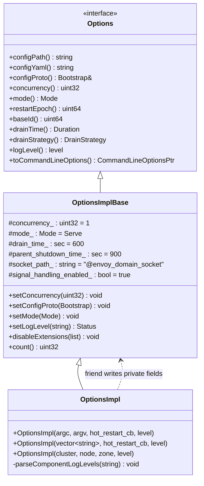
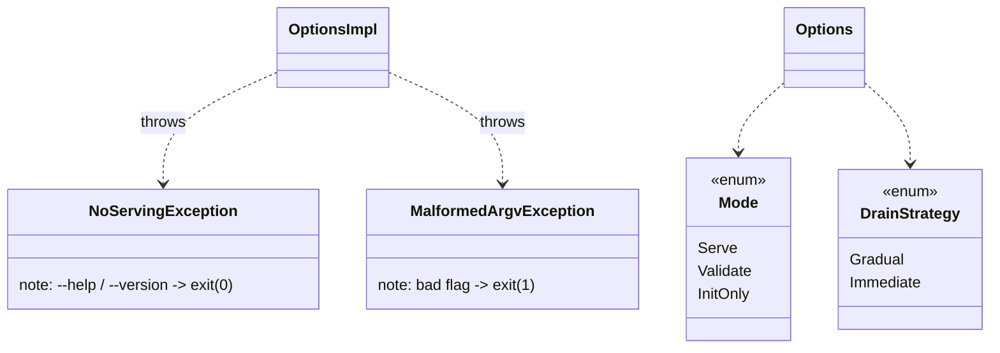
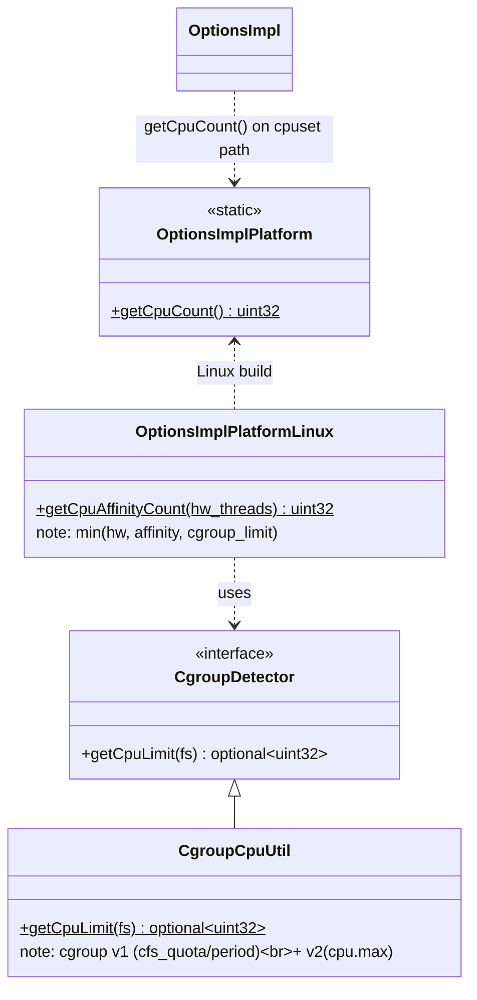

# Command-Line Options — Class Hierarchy

UML-style class diagrams for the options subsystem. Documentation aids, not exhaustive.

## 1. Interface, storage, and parser

`OptionsImplBase` is fully usable on its own (Envoy Mobile path). `OptionsImpl` only adds the
TCLAP front-end.

## 2. Exceptions and enums

## 3. The platform seam

The two `getCpuCount()` bodies (`options_impl_platform_default.cc` vs.
`options_impl_platform_linux.cc`) are selected by the build system, so the rest of the code
stays `#ifdef`-free.
