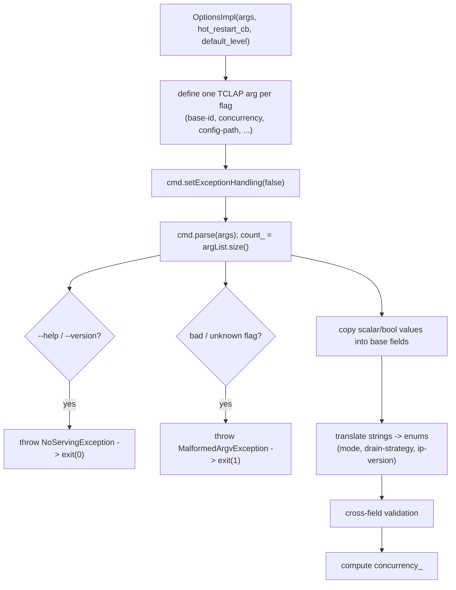
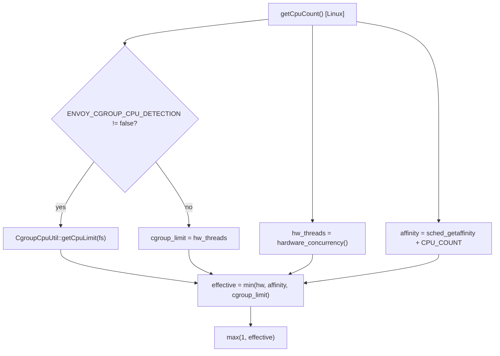
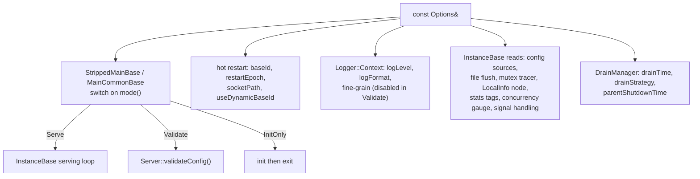

# Command-Line Options — Overview

This document covers the `Options` interface, the storage/parser split, the TCLAP parse and
validation flow, concurrency computation, the platform/cgroup abstraction, and how the parsed
options feed the rest of the server.

## 1. The `Options` interface

`Server::Options` (`envoy/server/options.h`) is a pure-virtual, read-only view of every CLI
flag plus a couple of computed values. The server holds a `const Options&` and never mutates
it. Accessors by theme:

| Theme | Accessors |
|-------|-----------|
| Config sources | `configPath()`, `configYaml()`, `configProto()`, `allowUnknownStaticFields()`, `rejectUnknownDynamicFields()`, `ignoreUnknownDynamicFields()`, `skipDeprecatedLogs()` |
| Concurrency | `concurrency()`, `cpusetThreadsEnabled()` |
| Hot restart | `restartEpoch()`, `baseId()`, `useDynamicBaseId()`, `baseIdPath()`, `skipHotRestartOnNoParent()`, `skipHotRestartParentStats()`, `hotRestartDisabled()`, `socketPath()`, `socketMode()` |
| Drain | `drainTime()`, `drainStrategy()`, `parentShutdownTime()` |
| Logging | `logLevel()`, `componentLogLevels()`, `logFormat()`, `logFormatSet()`, `logFormatEscaped()`, `enableFineGrainLogging()`, `logPath()` |
| Mode | `mode()` → `Serve` / `Validate` / `InitOnly` |
| Admin | `adminAddressPath()` |
| Bootstrap node | `serviceClusterName()`, `serviceNodeName()`, `serviceZone()` |
| Misc | `fileFlushIntervalMsec()`, `coreDumpEnabled()`, `mutexTracingEnabled()`, `signalHandlingEnabled()`, `localAddressIpVersion()`, `disabledExtensions()`, `statsTags()`, `toCommandLineOptions()` |

Two enums share the header: `Mode { Serve, Validate, InitOnly }` and
`DrainStrategy { Gradual, Immediate }`.

`toCommandLineOptions()` reflects every field back into the `envoy.admin.v3.CommandLineOptions`
proto — that's what the admin `/server_info` endpoint shows.

## 2. The storage layer: `OptionsImplBase`

`OptionsImplBase` (`options_impl_base.{h,cc}`) is "`Options` without command-line parsing".
It:

- declares every backing field with an in-class default (e.g. `concurrency_{1}`,
  `drain_time_{600}`, `parent_shutdown_time_{900}`, `mode_{Serve}`,
  `drain_strategy_{Gradual}`, `socket_path_{"@envoy_domain_socket"}`,
  `signal_handling_enabled_{true}`),
- implements every `Options` accessor inline, and
- exposes a parallel set of **setters that are not part of the `Options` interface**
  (`setConcurrency`, `setConfigProto`, `setMode`, ...).

The default constructor is annotated "for mobile" — embedders populate it via the setters.
A few helpers live in the `.cc`: `parseAndValidateLogLevel()` (maps a string to an spdlog
level, special-casing `"warn"`), `setLogLevel()`, and `disableExtensions()` (parses
`$CATEGORY/$NAME` and disables factories in the registry).

## 3. The parser: `OptionsImpl` and TCLAP

`OptionsImpl` (`options_impl.{h,cc}`) adds three constructors: from `argc/argv`, from a
`vector<string>` (the real parser), and a "reasonable defaults" one for tests/embedding.

The parse flow:



Notable details:

- The `--concurrency` TCLAP default is `std::thread::hardware_concurrency()`; `config-path`
  (`-c`) is the only flag with a short form.
- TCLAP's built-in exit is disabled; a failure handler converts `TCLAP::ArgException` into
  Envoy's own exceptions (`NoServingException` for help/version, `MalformedArgvException`
  for bad input). Both are declared in `options_impl.h`.

### Cross-field validation examples

```cpp
// --use-dynamic-base-id cannot combine with a non-zero --restart-epoch
if (use_dynamic_base_id_ && restart_epoch_ > 0) {
  throw MalformedArgvException(
      fmt::format("error: cannot use --restart-epoch={} with --use-dynamic-base-id", restart_epoch_));
}
```

Others: `--enable-fine-grain-logging` conflicts with `--component-log-level`; the deprecated
`--allow-unknown-fields` folds into `--allow-unknown-static-fields` with a warning;
`--socket-mode` must be valid octal unless the socket path is abstract (`@...`); `--stats-tag`
must be `tag:value`. (Note: `--config-path` and `--config-yaml` are *not* mutually exclusive
— `config-yaml` merges on top of `config-path`.)

## 4. Concurrency computation

```cpp
if (!concurrency.isSet() && cpuset_threads_) {
  concurrency_ = OptionsImplPlatform::getCpuCount();   // cpuset/cgroup-aware
} else {
  if (concurrency.isSet() && cpuset_threads_ && cpuset_threads.isSet()) {
    ENVOY_LOG(warn, "Both --concurrency and --cpuset-threads set; not applying --cpuset-threads.");
  }
  concurrency_ = std::max(1U, concurrency.getValue());
}
```

The hardware-concurrency default falls out naturally because it's the TCLAP arg default. The
platform `getCpuCount()` is only consulted on the `--cpuset-threads` path.

## 5. The platform / cgroup abstraction

`OptionsImplPlatform::getCpuCount()` (`options_impl_platform.h`) is a single static seam with
two implementations chosen at build time:

- **Generic / non-Linux** (`options_impl_platform_default.cc`) — returns
  `std::thread::hardware_concurrency()` and warns it's HW-thread based.
- **Linux** (`options_impl_platform_linux.{h,cc}`) — the minimum of:
  1. hardware threads,
  2. the CPU **affinity** count (`sched_getaffinity` + `CPU_COUNT`), and
  3. a **cgroup** CPU limit.



The cgroup detection (`cgroup_cpu_util.{h,cc}`) supports **cgroup v1** (`cpu.cfs_quota_us` /
`cpu.cfs_period_us`) and **cgroup v2** (`cpu.max`), parsing `/proc/self/cgroup` and
`/proc/self/mountinfo`. This is what makes Envoy's default worker count respect container CPU
limits. (See [`../diagnostics/`](../diagnostics/OVERVIEW.md) for the cgroup util internals.)

These interfaces are platform-specific because `sched_getaffinity`, `cpu_set_t`, and the
`/sys/fs/cgroup` quota files are Linux-only; the static seam keeps `#ifdef`s out of
`OptionsImpl`.

## 6. How options feed the rest of the server



The `Validate` branch routes to `Server::validateConfig(...)` (documented in
[`../config_validation/`](../config_validation/README.md)) and never starts the listener
loop; `Serve` runs the normal loop; `InitOnly` initializes and exits.
