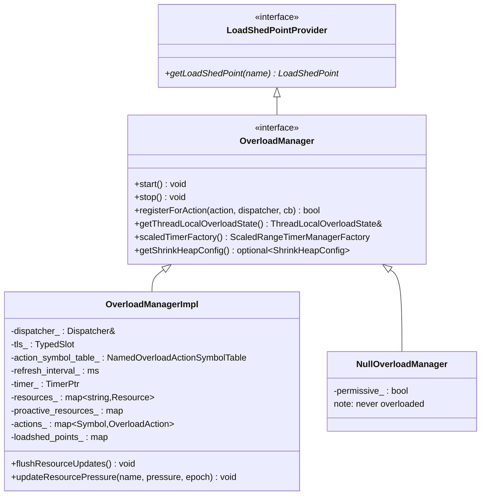
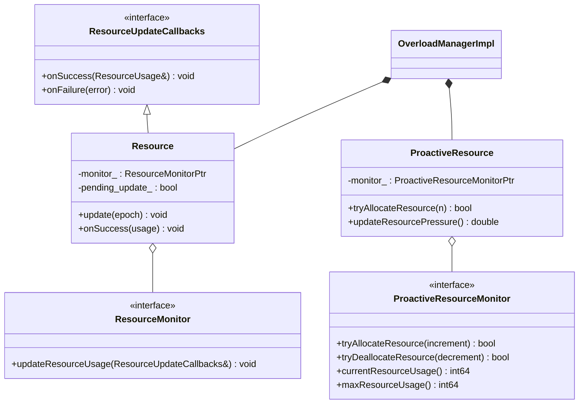
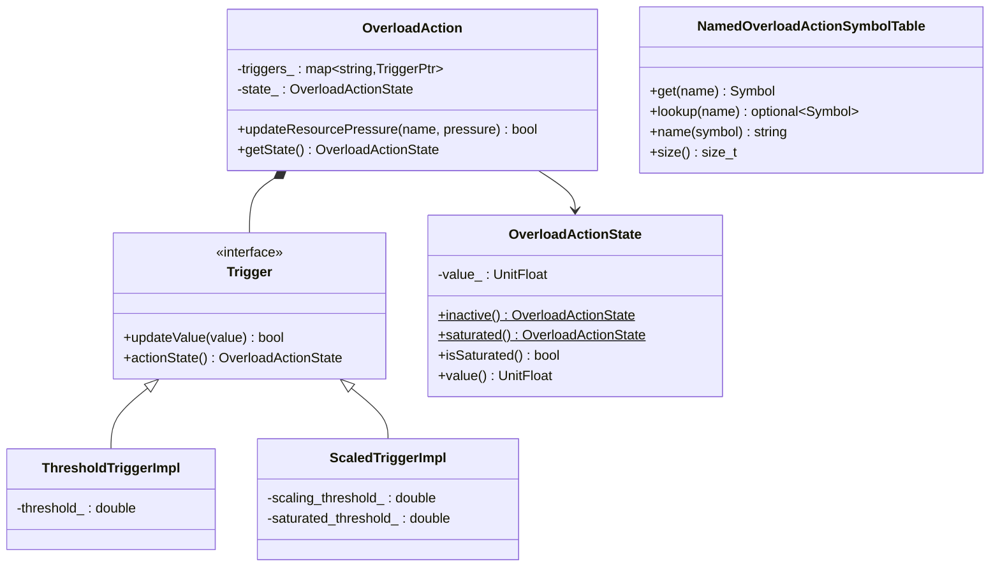
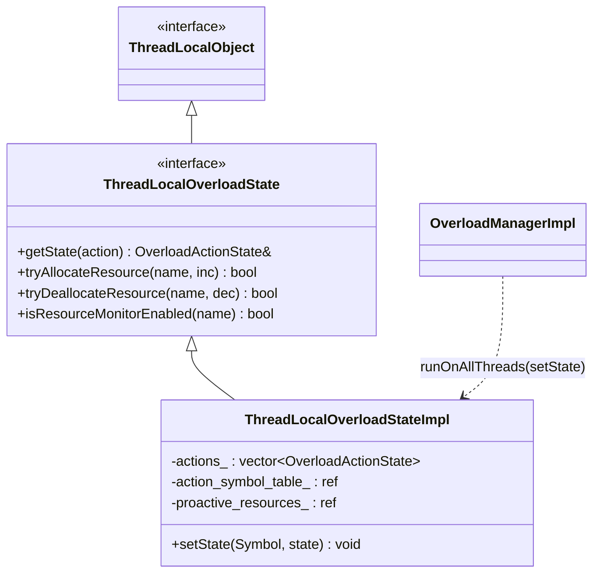

# Overload Manager — Class Hierarchy

UML-style class diagrams for the overload subsystem. Documentation aids, not exhaustive.

## 1. The manager



## 2. Resources and monitors



## 3. Actions, triggers, and the symbol table



## 4. Thread-local state



The flat `actions_` vector indexed by interned `Symbol` is what makes the hot-path
`getState(action)` an O(1), lock-free array read on each worker thread.

## 5. Scaled-timer link

```mermaid
flowchart LR
    OM["OverloadManagerImpl"] -->|scaledTimerFactory| STM["ScaledRangeTimerManager<br/>(per worker dispatcher)"]
    OM -->|reduce_timeouts callback| STM
    STM -->|setScaleFactor(state.invert())| Timers["scaled timers fire at<br/>min + (max-min)*factor"]
```
