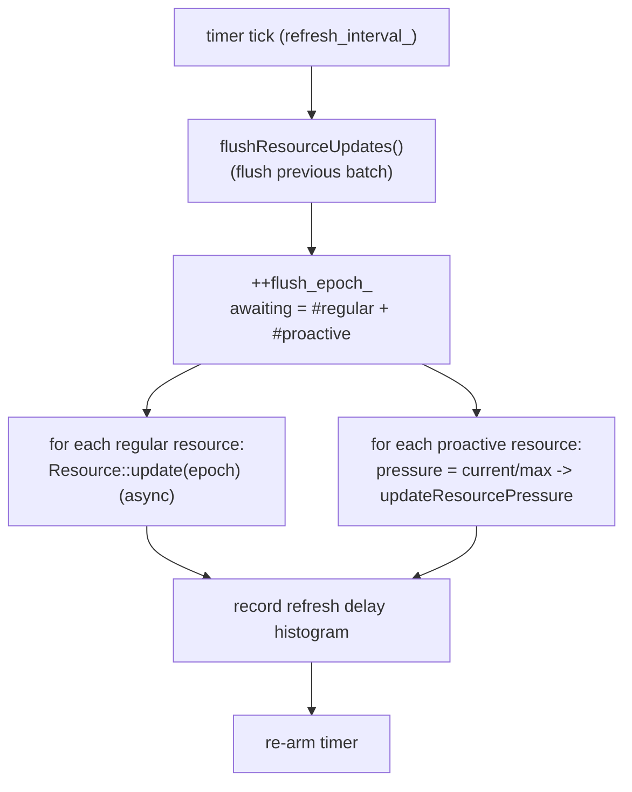
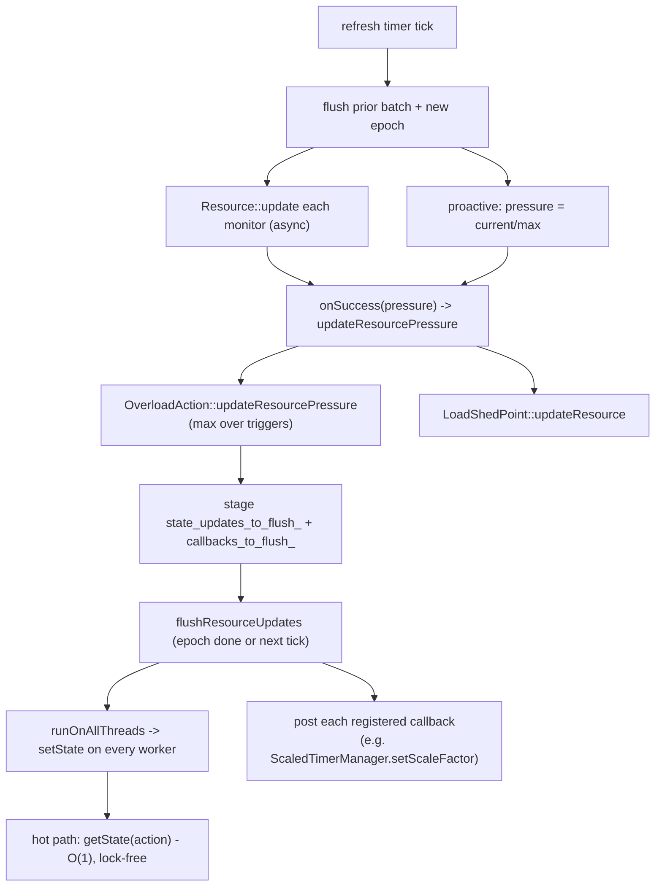

# Overload Manager — Overview

This document explains the refresh loop, how pressure turns into action state, the two
trigger types, the thread-local publish, scaled-timer integration, and proactive resources.

## 1. The refresh loop

`OverloadManagerImpl::start()` installs the per-worker thread-local state and (if any
regular resources are configured) arms a recurring timer at `refresh_interval_` (default
1000 ms). Each tick:



The `flush_epoch_` is a batching token: when all of a tick's awaited updates have reported
back, the manager eagerly flushes; otherwise the next tick's leading `flushResourceUpdates()`
guarantees nothing waits longer than one interval.

`stop()` disables the timer and clears `resources_` (so pending async updates are dropped).
`registerForAction(action, dispatcher, cb)` must be called **before** `start()`.

## 2. Resource monitors

A `ResourceMonitor` (`envoy/server/resource_monitor.h`) uses an **async pull** model:

```cpp
virtual void updateResourceUsage(ResourceUpdateCallbacks& callbacks) PURE;
```

It recomputes (non-blocking) and reports back via `onSuccess(ResourceUsage)` /
`onFailure(...)`. `ResourceUsage` is just `{ double resource_pressure_; }` — the fraction
`usage / limit`.

Monitors are built from config by factories (category `envoy.resource_monitors`). Examples
of how pressure is computed:

| Monitor | Pressure |
|---------|----------|
| Fixed heap | `used_heap / max_heap` |
| CPU utilization | EWMA: `util = current*0.05 + 0.95*util` |
| Injected resource | a float read from a file (test/forcing hook) |
| Downstream connections (proactive) | `current / max` via atomic CAS |

The manager wraps each monitor in an inner `Resource` (a `ResourceUpdateCallbacks`) that
guards against overlapping async updates and forwards the pressure plus sets a gauge:

```cpp
void OverloadManagerImpl::Resource::onSuccess(const ResourceUsage& usage) {
  pending_update_ = false;
  manager_.updateResourcePressure(name_, usage.resource_pressure_, flush_epoch_);
  pressure_gauge_.set(usage.resource_pressure_ * 100);
}
```

## 3. From pressure to action state

### Triggers

A `Trigger` maps a resource's pressure to an `OverloadActionState`. Two concrete kinds:

- **`ThresholdTriggerImpl`** — binary: `saturated()` when `value >= threshold`, else
  `inactive()`.
- **`ScaledTriggerImpl`** — graded: below `scaling_threshold` → inactive; at/above
  `saturation_threshold` → saturated; in between → a linear ramp.

```cpp
// ScaledTriggerImpl::updateValue
if (value <= scaling_threshold_) {
  state_ = OverloadActionState::inactive();
} else if (value >= saturated_threshold_) {
  state_ = OverloadActionState::saturated();
} else {
  state_ = OverloadActionState(
      UnitFloat((value - scaling_threshold_) / (saturated_threshold_ - scaling_threshold_)));
}
```

### Actions

An `OverloadAction` owns a map of named triggers (one per resource it watches). Its overall
state is the **maximum** over all its trigger states:

```cpp
bool OverloadAction::updateResourcePressure(const std::string& name, double pressure) {
  // update the trigger for `name`, then:
  OverloadActionState new_state = OverloadActionState::inactive();
  for (auto& trigger : triggers_) {
    if (trigger.second->actionState().value() > new_state.value()) {
      new_state = trigger.second->actionState();
    }
  }
  state_ = new_state;             // max over triggers
  return state_.value() != old_state.value();
}
```

`OverloadActionState` wraps a `UnitFloat` in `[0,1]` with `inactive()`, `saturated()`,
`isSaturated()`, and a `phase()` of `Inactive`/`Scaling`/`Saturated`.

### The symbol table

`NamedOverloadActionSymbolTable` interns action-name strings into dense sequential `Symbol`
indices. This lets the thread-local state store action states in a flat `std::vector`
indexed by `Symbol::index()` — an O(1) array lookup on the hot path instead of hashing
strings.

## 4. Publishing to worker threads

The main thread stages state changes, then publishes them to every worker's thread-local
copy via `runOnAllThreads`, and posts each registered callback to its dispatcher:

```cpp
void OverloadManagerImpl::flushResourceUpdates() {
  if (!state_updates_to_flush_.empty()) {
    auto shared = std::make_shared<...>();
    std::swap(*shared, state_updates_to_flush_);
    tls_.runOnAllThreads([updates = std::move(shared)](OptRef<ThreadLocalOverloadStateImpl> s) {
      for (const auto& [action, state] : *updates) s->setState(action, state);
    });
  }
  for (const auto& [cb, state] : callbacks_to_flush_) {
    cb->dispatcher_.post([cb, state]() { cb->callback_(state); });
  }
  callbacks_to_flush_.clear();
}
```

Hot-path read (cheap, lock-free):

```cpp
const OverloadActionState& ThreadLocalOverloadStateImpl::getState(const std::string& action) {
  if (auto symbol = action_symbol_table_.lookup(action); symbol) {
    return actions_[symbol->index()];   // O(1) array index
  }
  return always_inactive_;
}
```

## 5. End-to-end flow



## 6. Scaled-timer integration

The `reduce_timeouts` action shrinks timeouts under load. The manager exposes a factory
that builds a `ScaledRangeTimerManager` per worker dispatcher and registers it for the
action; as pressure scales 0→1, the timer scale factor is **inverted** (1→0) so timeouts
shrink toward configured minimums:

```cpp
Event::ScaledRangeTimerManagerFactory OverloadManagerImpl::scaledTimerFactory() {
  return [this](Event::Dispatcher& dispatcher) {
    auto manager = createScaledRangeTimerManager(dispatcher, timer_minimums_);
    registerForAction(ReduceTimeouts, dispatcher, [m = manager.get()](OverloadActionState s) {
      m->setScaleFactor(s.value().invert());   // 0 overload -> factor 1 (no scaling)
    });
    return manager;
  };
}
```

A scaled timer fires at `min + (max - min) * scale_factor`. The per-type minimums
(`timer_minimums_`) are parsed from the action's config (e.g.
`HTTP_DOWNSTREAM_CONNECTION_IDLE`). See
[`../../common/event/`](../../common/event/lifecycle_and_threading.md) for the scaled timer
manager internals.

## 7. Proactive resources

Proactive resources (e.g. `GlobalDownstreamMaxConnections`) are not gated by the timer for
*allocation*. The hot path calls `tryAllocateResource` / `tryDeallocateResource` directly on
the thread-local state, which delegates to the proactive monitor's atomic
`compare_exchange` loop bounded by `max`. The timer still samples their `current/max`
pressure so the value can also feed triggers/actions, but admission control itself is
synchronous and lock-free.

## 8. `NullOverloadManager`

`null_overload_manager.h` is a no-op manager that is never overloaded — used to keep the
admin interface reachable even when the data plane is saturated. Its `getState()` always
returns `inactive`. A `permissive_` flag controls proactive allocation: in non-permissive
mode (admin) it rejects allocations and returns a null scaled-timer factory; in permissive
mode (Envoy Mobile) it allows allocations and returns a real (unscaled) timer factory.
